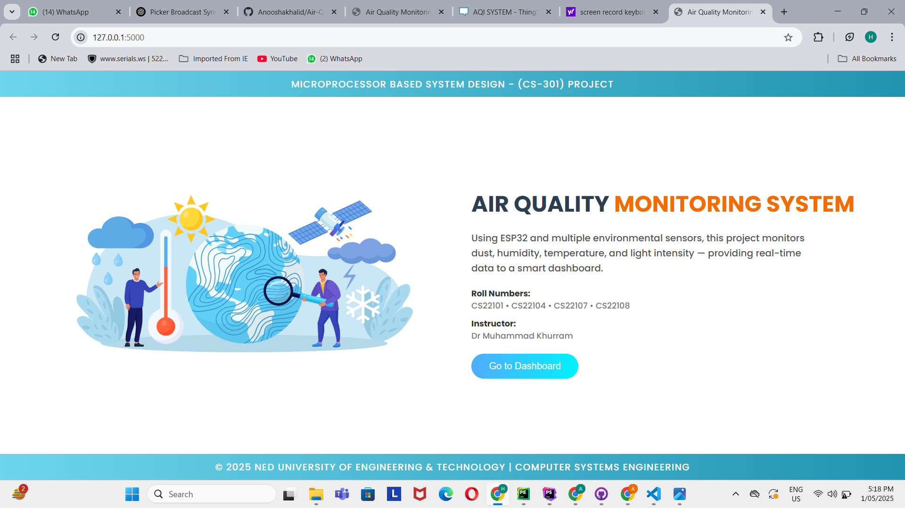
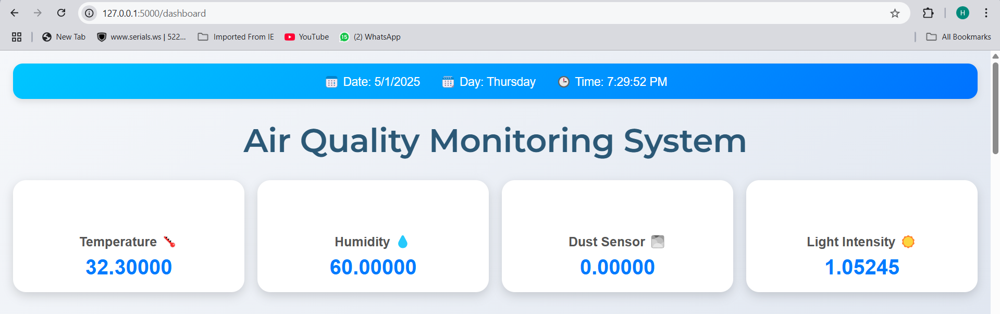
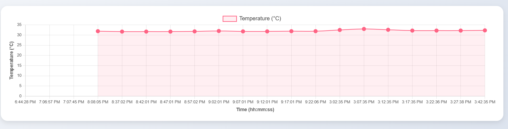
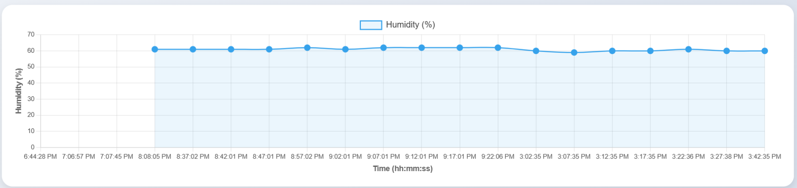
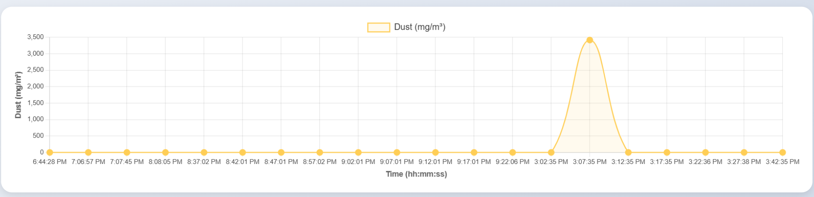
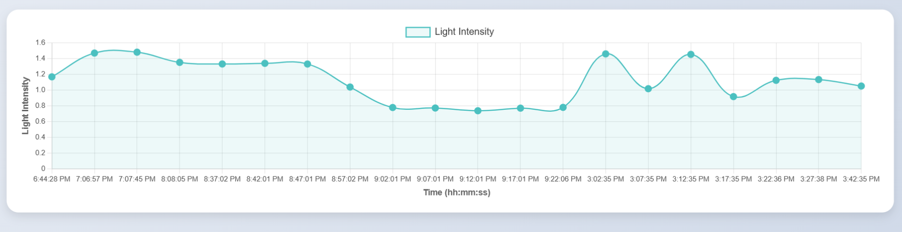

# Air Quality Monitoring System

This is a web-based Air Quality Monitoring System developed using Python (Flask) and HTML/JavaScript. It visualizes real-time environmental sensor data such as temperature, humidity, dust, and light intensity. The system includes interactive charts and a live data table for monitoring purposes.









## Features

- Real-time data visualization from **ThingSpeak** using a public Channel ID.
- Interactive charts for:
  - Temperature
  - Humidity
  - Dust level
  - Light intensity
- Raw data table with timestamped entries.
- Displays current **date**, **day**, and **time** without using third-party APIs.
- Clean, modern UI with responsive design.


## Technologies Used

- **Backend**: Python, Flask
- **Frontend**: HTML5, CSS3, JavaScript, Chart.js


## Project Structure

```
AirQualityMonitoringSystem/
├── static/
│    ├── images/
│       └── cover1.jpg
├── templates/
│   ├── home.html
│   └── index.html
├── app.py
├── venv/
│   License
└── README.md
```


## How to Run

1. **Clone the repository** (or download the project):
   ```bash
   git clone <repo-url>
   cd AirQualityMonitoringSystem
   ```

2**Install dependencies**:
   ```bash
   pip install Flask
   ```

3**Run the application**:
   ```bash
   python app.py
   ```

4**Open your browser** and navigate to:
   ```
   http://127.0.0.1:5000/
   ```


## Notes

- To enable location-based city and country detection, you can use the IPInfo API.
- Without the token, location detection is disabled by default.


## Contact

For questions, feedback, or contributions, please contact:

**Email**: anooshakhalid999@gmail.com  
**Institution**: NED University of Engineering & Technology  
**Department**: Computer Systems Engineering
